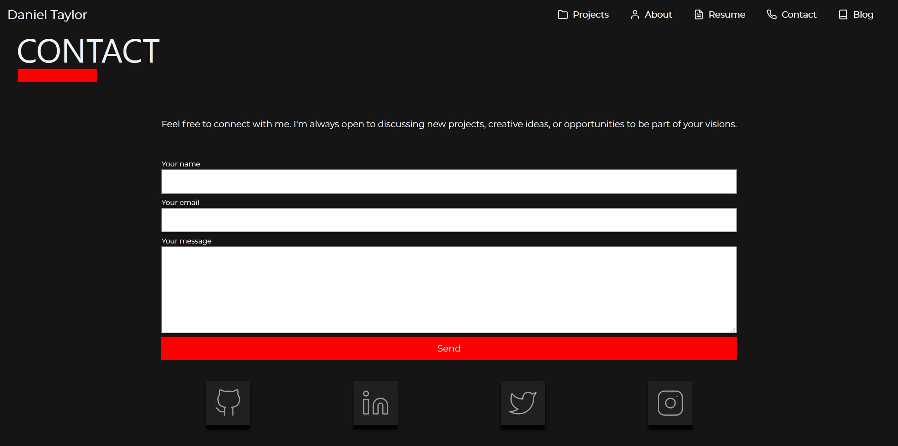
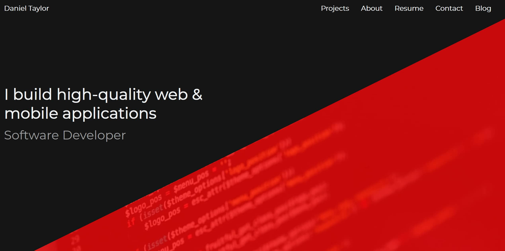
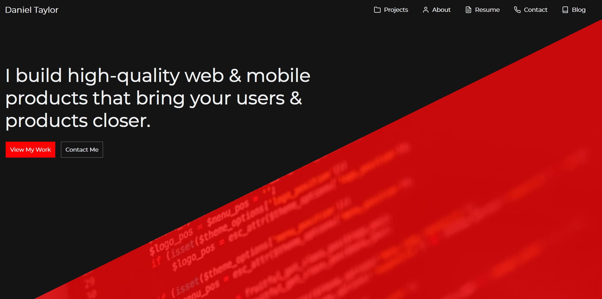
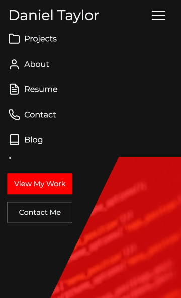
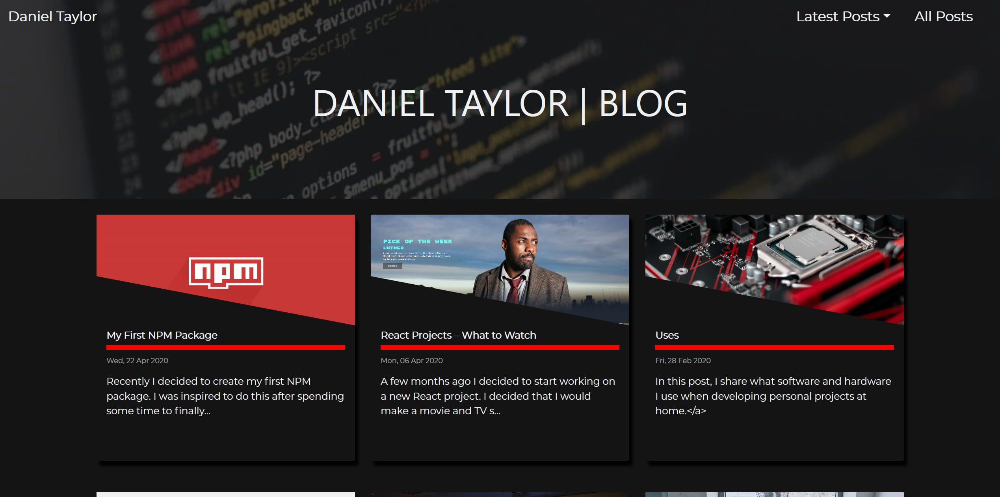
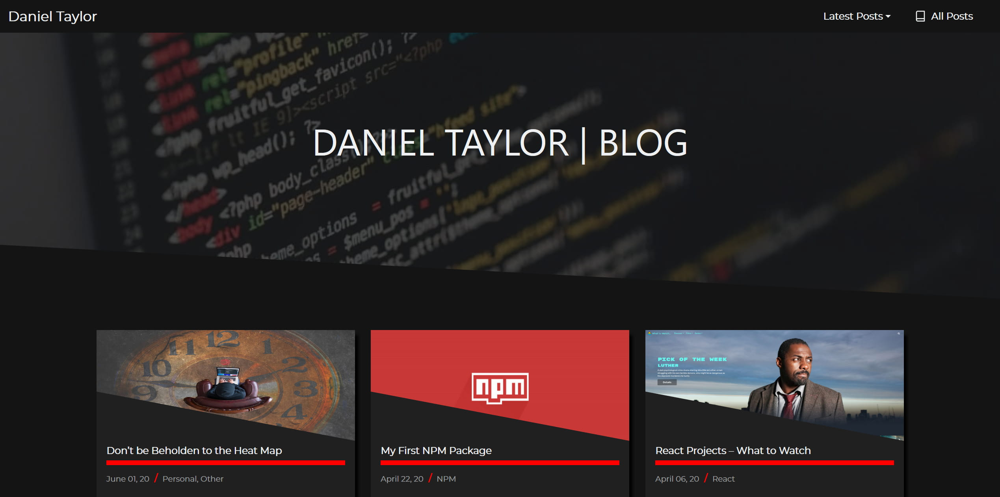
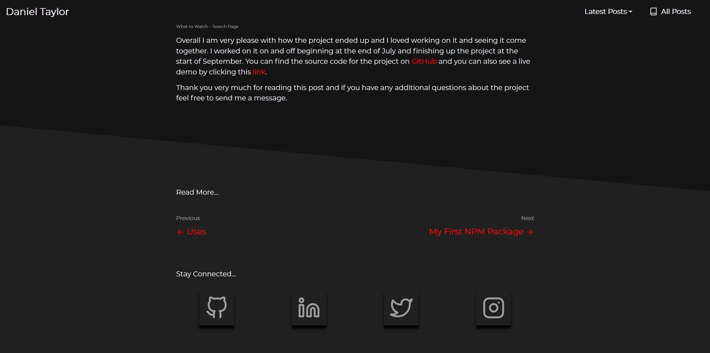
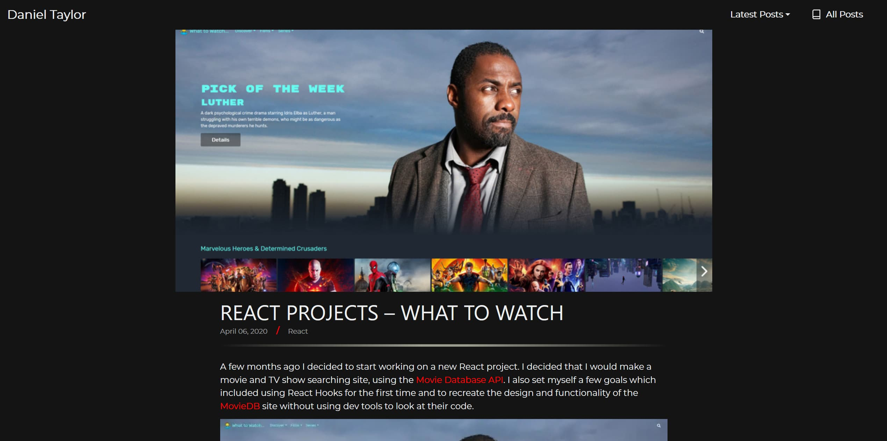

Several weeks ago I decided that I would move the hosting of my website over to <a href='https://www.google.com/url?q=https://www.netlify.com/&amp;sa=D&amp;ust=1591456048028000'>Netlify</a>. Accompanying this move, I believed it would be a good idea to add some new features to the site and make enhancements to other areas for better user experience and to give it more of a professional look and feel.

## Contact Form

The first new feature that I made on my website was to remove my email link from the contact section of my site and replace it with a contact form. I made this change after watching some UX videos about the benefits a contact form can give you over a mailto link. One of the main benefits that swayed me to add this is that it can be better for mobile users as not everyone may have an email set up on their device.

<figure>
  
  <figcaption>Screenshot of this sites contact form</figcaption>
</figure>

The final thing that swayed me was watching one of <a href='https://www.google.com/url?q=https://www.youtube.com/watch?v%3Di6dZTL7gsCY&amp;sa=D&amp;ust=1591456048028000'>Jason Lengstorf</a> videos and seeing how easy it is to work with <a href='https://www.google.com/url?q=https://docs.netlify.com/forms/setup/&amp;sa=D&amp;ust=1591456048029000'>Netlify Forms</a>. And after adding it and setting it up, I feel safe in saying setting up a contact form and email notifications for form submissions was a nice and straightforward process.

## Header

Another bit of UX I improved was adding two call to action buttons on my header. I styled the main one in the bright and bold red I use for my site&#39;s highlights that takes the user straight to the project section. With the second button taking the user to the contact section.

<figure>
  
  <figcaption>Screenshot of this sites original header.</figcaption>
</figure>

The final change I made to the header was the description. I wanted to make this clearer about what I do and the benefits I bring to potential employers and clients. Whilst making this change I typed it out on <a href='https://www.google.com/url?q=https://grammarly.com&amp;sa=D&amp;ust=1591456048029000'>Grammarly</a> to help with the spelling and grammar. Then I asked two people, one with a technical background and one without, for feedback and made changes until both of them liked what I had.

<figure>
  
  <figcaption>Screenshot of this sites updated header.</figcaption>
</figure>

## Navbar

The Navbar has had quite a few changes. First, I changed the navbar on my blog page to be more in line with the style of the navbar used through the rest of the site. I then changed them from being stuck at the top of the page to scrolling down with the user, to improve the time to navigate around the site.

<figure>
  
  <figcaption>Screenshot of this sites original mobile navbar.</figcaption>
</figure>

Icons have also been added with the text to add more personality and make it more interesting. Finally, I changed the default <a href='https://www.google.com/url?q=https://react-bootstrap.github.io/components/navbar&amp;sa=D&amp;ust=1591456048030000'>React Bootstrap</a> mobile icon for the navbar. I felt the new icon is a better fit as it is from the same icon library that the rest of the site&#39;s icons are.

<figure>
  
  <figcaption>Screenshot of this sites updated mobile navbar.</figcaption>
</figure>

## Blog Home Page

Alongside the changes to the navbar for the blog, I also changed the style of the blog home page header. I made the image get cut off at the bottom, similar to the effect used around the rest of the site. Again I did this just to make it look more in line with the design and style of the overall site. Whilst still keeping a simple and straight to the point look, I wanted.

<figure>
  
  <figcaption>Screenshot of this sites original blog home page.</figcaption>
</figure>
<figure>
  
  <figcaption>Screenshot of this sites updated blog home page.</figcaption>
</figure>

## Blog Post

This was probably the area of the website that changed the most.

### Footer

To make the site feel more professional and easier to use. Links to the previous and next blog posts, where available. Have been added to the footer of the current post. I like how posts look with this added and I hope by doing this it improves the user experience of navigating between posts.

<figure>
  
  <figcaption>Screenshot of this sites blog post new footer.</figcaption>
</figure>

In a bit of self-promotion, I also added my social buttons from the contact section of the site to the footer. To give me another plug and make it easier for anyone that would wish to stay up to date with me and my work. Thankfully because of how easy components can be reused, the only effort I had to put in to add this feature. Was to break out the social buttons from the contact section and make them into their component, which perhaps should have already been done.

### Header Image

The scaling for the header image has also been changed to take less width but
can now use more height to fit better in the post.

<figure>
  
  <figcaption>Screenshot of this sites original blog post header.</figcaption>
</figure>
<figure>
  
  <figcaption>Screenshot of this sites updated blog post header.</figcaption>
</figure>

### categories

Another addition I make to the blog posts to help with the professional look and feel was to add categories to the posts.

### Sizing Updates

The final update to the blog posts was some adjustments to the size of the paragraphs and headers on different screen sizes to make better use of space for both text and white space.

## SEO

The final and one of the most important areas of the site that was updated was the sites SEO. I started by improving the description for both the home page and the blog page, by including more information about me, my skills and what visitors should expect. I then included the excerpt of the blog posts as their description. I then added a screenshot of the home and blog pages as the image for their respective SEO image tags. Again, I also used the feature image of the blog posts for their SEO image.

## Thank You

Once again thank you very much for reading and if you have any issues or queries with any of the content on the site, then please get in touch.
