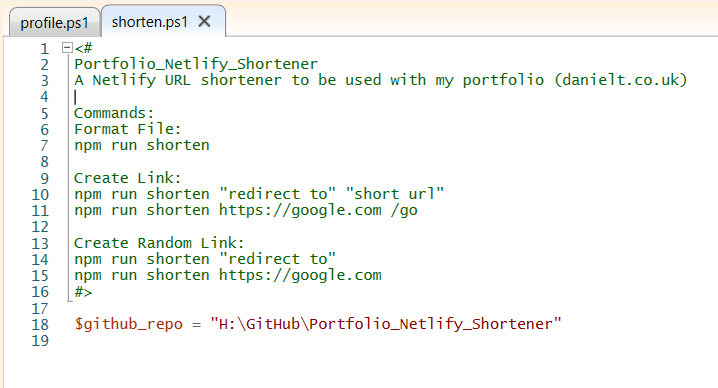
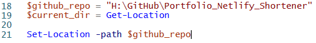
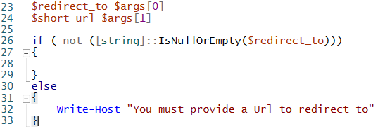
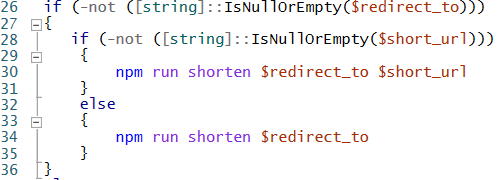
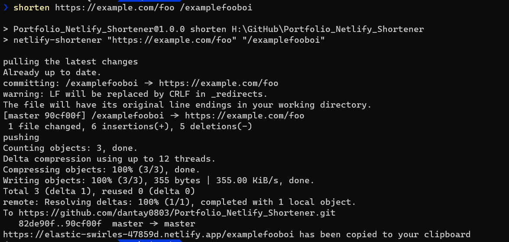

TLDR; You can find the full code for the script at the end of this post.

Recently I followed along with a tutorial from <a href='https://twitter.com/kentcdodds'>Kent C. Dodds</a>. In which he creates a <a href='https://www.youtube.com/watch?v=HL6paXyx6hM'>URL shortener with Netlify</a>. After following along with the tutorial. I decided that I wanted to create a PowerShell script to run the NPM command from my terminal. And I thought it may be useful for some people for me to share how I accomplished this.

<iframe
  width="560"
  height="315"
  src="https://www.youtube.com/embed/0huv3WbNO_s"
  frameborder="0"
  allow="accelerometer; autoplay; encrypted-media; gyroscope; picture-in-picture"
  allowfullscreen
></iframe>

To write the script, I used the Windows PowerShell ISE as you can run your script in the terminal below it. But you can write this with any text editor. The first thing I did was break down what I needed the script to do.

<ul>
  <li>Get URL to redirect to</li>
  <li>Get user-submitted short URL - optional</li>
  <li>Change directory to our GitHub Repo</li>
  <li>Run the NPM command passing in our argument(s)</li>
  <li>Change back to our original working directory</li>
</ul>

## Step 1 - Set Project Path

I started the script off by pasting the contents of the repositories .readme into a comment. This is to remind me of how the project works in case I ever forget. Then by using the dollar symbol I defined a variable that points to the path of my GitHub repo that has the command.

<figure>
  
  <figcaption>
    The PowerShell Script with the comment and Github Repo Variable added.
  </figcaption>
</figure>

## Step 2 - Get and Set Directory

To get my current working directory path, that I will navigate back to. I make use of the PowerShell Get-Location command. That as you imagine, gets the current directory the terminal is accessing.

<figure>
  
  <figcaption>
    The PowerShell Script updated to get and set user's location.
  </figcaption>
</figure>

To set the working directory of the terminal. I use the Set-Location command and set its path value to the variable value for my repo, which we set in step 1.

## Step 3 - User Arguments

Next Up I created two new variables one for the URL we want to redirect to and one optional one that allows us to set a shortened URL. The second argument is optional as the <a href='https://www.npmjs.com/package/netlify-shortener'> netlify-shortener package </a> we are using can auto-generate a short URL.

<figure>
  
  <figcaption>
    The PowerShell Script updated to get and check for user input.
  </figcaption>
</figure>

We use the $args variable like an array and access each item at an index. So anything the user adds will get added to $args. For example, if we run.

| Command | Redirect To        | Short URL |
| ------- | ------------------ | --------- |
| shorten | https://google.com | googly    |

We can access the URL at $args[0] and access googly at $args[1].

## Step 4 - Checking for Arguments

Before calling our NPM script I wanted to ensure that the user has supplied a redirect-to URL otherwise there is no need to run the NPM Command. This is done using your typical if-else statement. As you can see in the image below. The if statement checks if the string we have assigned to our redirect_to variable is not null or empty. If the redirect URL is not empty, we will run the first block of code. And if the redirect URL is empty, we use the Write-Host command to print a message to let the user know this is required.

<figure>
  
  <figcaption>The PowerShell Script updated to run the NPM command.</figcaption>
</figure>

## Step 5 - Running NPM Script

Finally, to run our NPM Script. Again I added an if-else statement to check if our optional short URL is passed or not. Then I run the NPM script as if you were typing it into the terminal passing in the URLs provided by the user in step 3.

<figure>
  
  <figcaption>
    Running out PowerShell script in the new Windows terminal.
  </figcaption>
</figure>

## Creating a Profile and Alias for your Script

If you want to run your script with an Alias name and not have to navigate to the scripts directory every time.

Run:

```powershell
\$PROFILE | Format-List -Force
```

This will list all the locations you can add a PowerShell Profile. I went with the “CurrentUserAllHosts” option that pointed to My Documents folder. So I created a file named profile.ps1 here and added the following lines.

```powershell
$ps_script_dir = "C:\Users\user\Documents\WindowsPowerShell"

Set-Alias shorten -value \$ps_script_dir\shorten.ps1
```

This creates a PowerShell Alias named shorten that points to the location of the script we created above. So you can now run this script by calling shorten and passing in your arguments.

## PowerShell Core Issue

I am using the new Windows Terminal. I followed this blog by <a href='https://twitter.com/shanselman'>Scott Hanselman</a> showing how to <a href='https://www.hanselman.com/blog/HowToMakeAPrettyPromptInWindowsTerminalWithPowerlineNerdFontsCascadiaCodeWSLAndOhmyposh.aspx'>style your terminal</a>. Once I tried running the script with this PowerShell Core window. It didn't recognise the “shorten” command. But I found that if I add the same profile.ps1 file to “AllUsersAllHosts” location you can get by running the profile list command above. That will sort the issue.

For anyone wondering my path was at:

C:\Users\user\\.dotnet\tools\\.store\powershell\6.2.3\powershell\6.2.3\tools\netcoreapp2.1\any\win

## Enable PowerShell Scripts

If you cannot run the PowerShell script. Ensure you have run the following
command on your machine and allowed scripts to be run.

```powershell
Set-ExecutionPolicy RemoteSigned
```

## Final Code

```powershell
$github_repo = "H:\GitHub\Portfolio_Netlify_Shortener"
$current_dir = Get-Location

Set-Location -path $github_repo

$redirect_to=$args[0]
$short_url=$args[1]

if (-not ([string]::IsNullOrEmpty($redirect_to)))
{
    if (-not ([string]::IsNullOrEmpty($short_url)))
    {
        npm run shorten $redirect_to $short_url
    }
    else
    {
        npm run shorten $redirect_to
    }
}
else
{
    Write-Host "You must provide a url to redirect to"
}

Set-Location -path $current_dir
```
