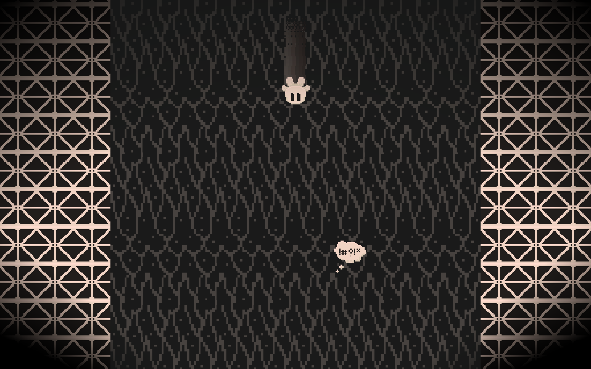
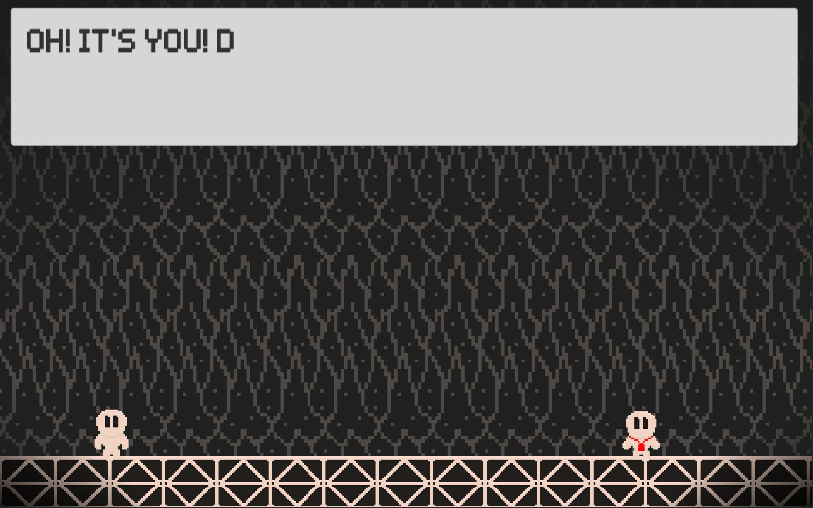
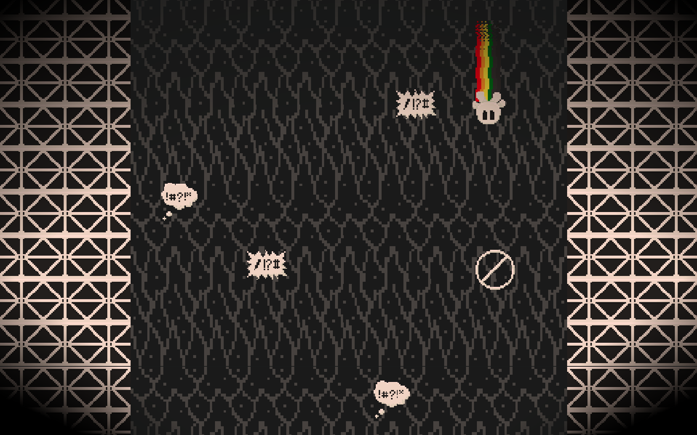

<iframe
  src="https://itch.io/embed/740840?bg_color=141414&amp;fg_color=EEF0F2&amp;link_color=FF0000&amp;border_color=202020"
  width="552"
  height="167"
  frameborder="0"
>
  <a href="https://dantay0803.itch.io/falling-together">
    Falling Together by DanTay0803
  </a>
</iframe>

At this start of this month, my friend suggested out of the blue that we should take part in Rainbow Jam 2020. A two-week-long game jam. In which solo or teams of developers create a game, with the option to use the suggested theme.

I was sceptical at first by his idea. As I hadn't done any game-related programming for two years. With his time away from any game development being longer than that. Plus when I used to suggest the same idea when I worked as a Unity mobile developer he would say no more often than yes.

But after my suspicions disappeared, I agreed to take part. As well as doing the game jam I have started a new job as a React Native developer. So I was spending some time at nights improving my knowledge in that area as well.

<figure>
  
  <figcaption>Screenshot of Falling Together Game level one.</figcaption>
</figure>

## Selecting a Game Engine

Due to the limited time of the jam and other responsibilities. I knew that I wanted to use an engine with a visual editor, such as Unity or Unreal Engine. It makes the development experience quicker. Especially as I would be getting my friend to layout the levels and he doesn't have much coding experience.

I also wanted to go with an engine that would allow me to use a programming language I was familiar with. So It came down to Unity, Godot and Game Maker. After looking into the engines, I decided it would be best to stick with Unity. As I would have been even rustier with Game Maker and have not used Godot before.

<figure>
  
  <figcaption>
    Screenshot of the first cutscene in Falling Together game.
  </figcaption>
</figure>

## Forgetting More Than I expected

I knew going into this I would need to look up the Unity docs and tutorials a few times. And I was not wrong about this assumption. Some areas such as getting Rigidbody objects to collide with other objects was completely blank in my memory. Yet, other things such as knowing I would need to use a coroutine for a specific function in the game. Was like muscle memory. Then to set up animations, I had to jog my memory again.

## Learning New Things

Even though I only put in around 15 hours of development time during the two weeks. I was happy that I still got to learn new things and add some features to the game that I had never had experience with. The first thing I got to experience was Unity's Tilemap system. Which made laying out the simple levels for our game a lot quicker than the old way of doing things. I also got to use the new, or at least new to me. 2D render pipeline. Using this allowed me to add lights to the scene, which helped with the look of the game.

<figure>
  
  <figcaption>Screenshot of Falling Together Game level five.</figcaption>
</figure>

I finally got to use the Unity Timeline to create little cutscenes between the levels of the game. Using this I was able to animate and move two different characters. Play a smoke animation and display and animate text. Even though the cutscenes were only around 10 seconds long and made up of simple content and animations. Using the Timeline made it super simple and gave the game a lot more personality.

## Final Feelings

Even though I was hesitant at first to take part, I'm glad that I did. I am happy with how the game ended up. It's not the most original of ideas or has any groundbreaking features. But it was fun and it does a good job of tying into the theme of the jam. And will hopefully leave players with a warm happy feeling.

Also, it was one of the very few games, I've made that my mum played. With it being the game she's played the longest. After playing it for half an hour with no breaks.

You can find the game linked at the top of the post. Be sure to leave a comment on the game letting me know what you thought or reach out to me via the contact form or on Twitter.

Thanks for reading and have a good day.
