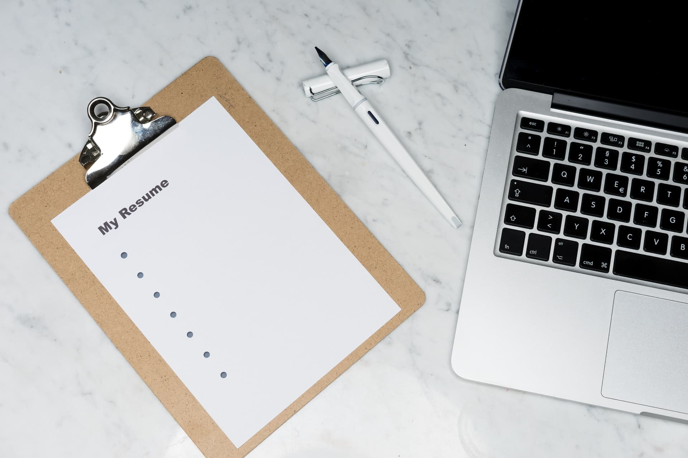
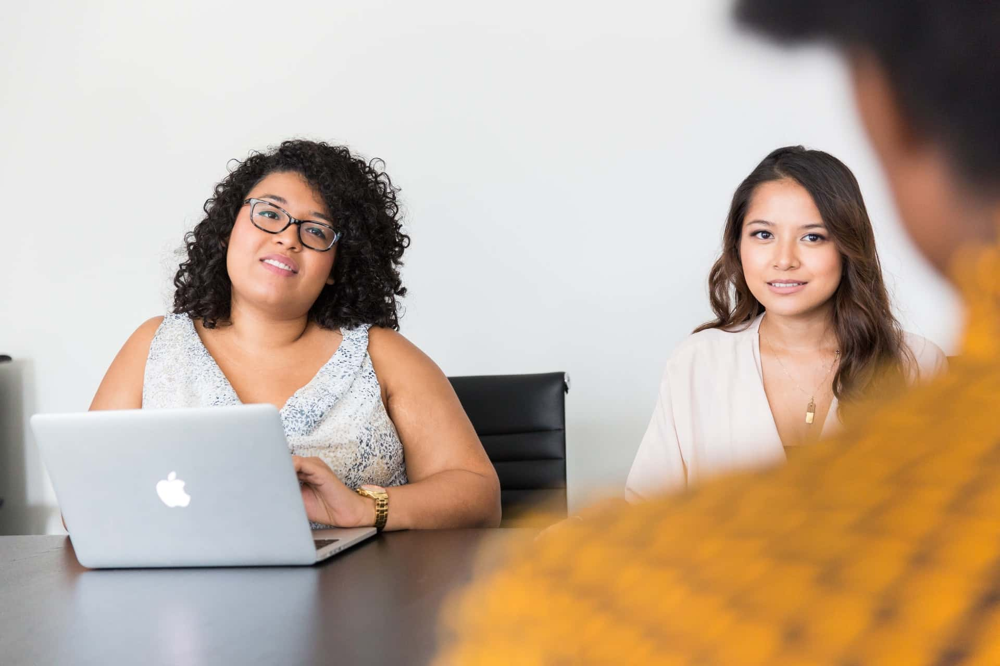
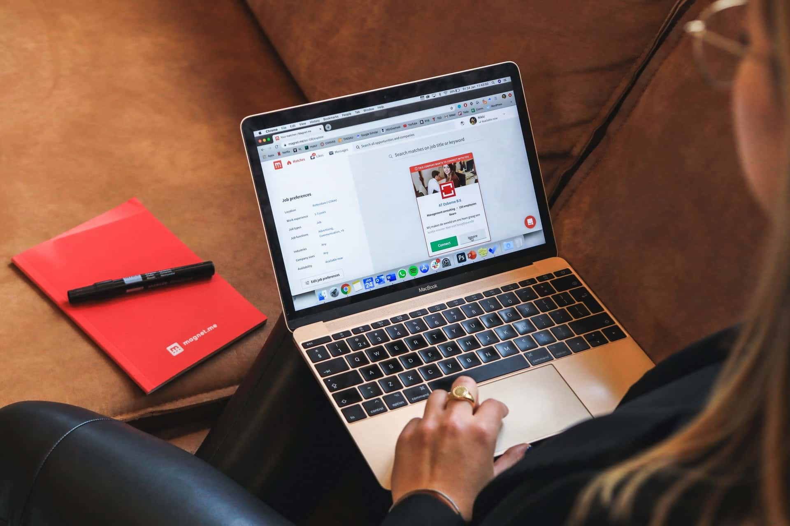

Like many others in the UK and around the world. I found myself placed on furlough from the end of March/start of April. I then had a week of being told I could be made redundant, before finally being made redundant. Due to the lack of customer work as a result of the Coronavirus.

Hearing the news was a bit of a bittersweet moment. I had spent the last couple of months not 100% enjoying my role. Due to some technical and personal issues at my place of employment. But there was talk of drastic changes. I felt these changes would set us on the right track and reinvigorate myself and the team. But I would not get to see these changes and had now gone from wanting to leave and look for a new job to having no choice.

My contract stated that if I wanted to leave I would have to work a 4-week notice period. But I also got that benefit as my employer needed to give me four weeks' notice before my contract ended. So I had an extra 4 weeks when I would continue to receive furlough pay and receive payment for holidays not taken. I guess not needing to take any holidays due to the global situation helped me out here.

I thought that documenting my process and journey of looking for a new job. Could be beneficial for others in a similar situation. Or for people getting their start in the industry.

## My First Role

Getting my foot in the door of the software industry. Was by far the hardest experience of any job-hunting whilst being in this industry. I can’t remember exactly how many jobs I applied for over this time. But if I had to guess, I would say I applied for around 20 positions at the least. What helped me secure a role, was attending a university showcase event. Where recruiters and employees from various industries could visit and view student work.

At this event, I would meet my soon-to-be colleague and showed him my work and sold myself and my skills as best I could. I decided to showcase a variety of projects using various technologies to show off my skills. But when I learned that the role he was hiring for. Was for a Unity Mobile Developer. I focused on showing my Unity projects and self-released mobile games. I also gave him a business card I had made with my contact and portfolio information on it.

<figure>
  
  <figcaption>
    Photo by
    <a href="https://unsplash.com/@markuswinkler?utm_source=unsplash&amp;utm_medium=referral&amp;utm_content=creditCopyText">
      Markus Winkler
    </a>
    on
    <a href="https://unsplash.com/?utm_source=unsplash&amp;utm_medium=referral&amp;utm_content=creditCopyText">
      Unsplash
    </a>
  </figcaption>
</figure>

This event took place in March and I did not hear back about this role until July. When he offered me an interview. I decided to take a couple printed resumes to hand out to the interviewers. As well as my laptop to showcase my projects and their source code. I didn’t know if this was a typical thing to do, but it did benefit me. After the interview, they asked me to critique the current state of the application I would work on. And provide them with an email of the feedback.

I spent a few days playing with everything the application offered. Making notes of my honest opinions on everything. From big changes and issues to little areas I felt could add some polish to the application. After I sent this in I waited another two weeks to hear from them and I started only a week after accepting their offer.

## My Second Role

My second role would be a bit of a shift for me. I had started out learning software development to make games. Which seen me work on a children's library app. That combined traditional features. Such as searching for books with mini-games for users to unlock and play. But after working on non-game related software for so long. I decided I would like to move away from the games side and try out a more “traditional” software role.

So I started looking for jobs as a non-game C# developer. This time it was much easier, as I now had two years of professional experience. With my first project seeing me as the lead and only developer on the project. I went from having 2 interviews in 4 months, looking for my first role. To having 3 interviews in 3 weeks.

The first interview I had was a quick call to ask some questions about my background and experience. This did not progress into anything, I’m not sure why as I didn't get any feedback. The second company that contacted me also gave me a phone interview. That progressed into a Skype interview with their chief technical officer. I felt like the interview went OK, but I knew myself I wouldn’t be progressing any further. Then a few days later I heard that they were looking for someone with more experience.

I didn’t let that get me down and kept applying. Around a week later I had a phone interview. With the company that I would end up working for in my second role. This phone interview again, involved them find out about me. As well as letting me know more about them and the type of work I would be doing.

<figure>
  
  <figcaption>
    Photo by
    <a href="https://unsplash.com/@wocintechchat?utm_source=unsplash&amp;utm_medium=referral&amp;utm_content=creditCopyText">
      Christina @ wocintechchat.com
    </a>
    on
    <a href="https://unsplash.com/?utm_source=unsplash&amp;utm_medium=referral&amp;utm_content=creditCopyText">
      Unsplash
    </a>
  </figcaption>
</figure>

A day later they asked me to come in for a first-stage technical interview at their office, which I accepted. Though, I would end up not being able to attend due to personal issues coming up. I did try to rearrange the interview, but they informed me this would not be possible.

I did feel down about this at the time. But again I kept my head up and kept applying for more roles. About two weeks later, I got a call from the recruiter that was handling my application. They said the company wanted to arrange another face to face interview. As they liked my portfolio and application. I was also asked to complete a technical project. They said to only spend four hours working on it. And at the end to send them a link to a GitHub repository. In the end, I went over the four-hour limit and spent about five or six hours on the project. I was open with them about this during the interview.

It turned out they suggested four hours as they didn’t want to take up too much of someone's spare time. But as I enjoy coding, I had no issues spending more time on it. Thankfully the technical interview was not as scary or hard as I initially thought. But I'm glad I did spend a few days preparing for it going over some C# and JavaScript coding principles. Yet, this didn't stop me from completely forgetting how to declare a function in JavaScript. If you find yourself in the same or a similar situation. Do what I did stand there looking as if you are thinking about the solution whilst your brain boots back up.

### My Third Role

While looking for my third role I knew that I wanted to do something different and liked the idea of working at an agency where I could work on different types of projects. So the first thing I did was to search for web and mobile agencies in the area that I would be willing to travel to.

Once, I had found a pool of agencies. I carefully looked around their website and social media to see if they were still in business. This was because I noticed some still had a website and social media presence but were not open for business.

Once I had removed the inactive businesses I then removed all the ones that were not looking for staff and were not open to receiving resumes for potential staff. Finally, I went through each of the companies' websites and looked at the type of projects they undertook. And removed the companies working on projects I was not interested in.

After all of that, I was left with 6 agencies that I felt would be great places to work for. Not all of them were actively looking for developers but I still sent out emails to them all. I sent the emails out on Monday, and they consisted of a cover letter highlighting my most relevant skills and projects to each company. As well as a copy of my resume and my contact details at the bottom of the email.

I got my first response on Tuesday, which turned out to be an unsuccessful application as they were not looking for staff. But after applying for countless jobs with no reply. I was grateful they took the time to get back to me.

<figure>
  
  <figcaption>
    Photo by
    <a href="https://unsplash.com/@magnetme?utm_source=unsplash&amp;utm_medium=referral&amp;utm_content=creditCopyText">
      Magnet.me
    </a>
    on
    <a href="https://unsplash.com/?utm_source=unsplash&amp;utm_medium=referral&amp;utm_content=creditCopyText">
      Unsplash
    </a>
  </figcaption>
</figure>

That same day I updated my LinkedIn profile to show I was actively looking for work. Which, resulted in me being contacted by the recruiter that placed me in my second position. They arranged a call with an IoT company on the following Thursday afternoon. Then on Wednesday I was contacted by one of the agencies I emailed. With the offer of a video interview on Thursday morning, which I accepted.

I felt the call with the agency on Thursday morning went well. Hearing more about some projects that they did not show on their website made me more interested in the company. The interview on Thursday afternoon, however, did not go as well. During the call, I did not think I was a good fit for the role, and I was not 100% invested in it. So I turned down the role then and there to save myself and the company from potentially wasting each others time.

But by Friday I had good news as the agency I video interviewed with. Asked me to work on a React Native project. To see my skill level and give me an idea of the work I would be taking on in a role there. This was the second time I had ever worked with React Native. But as I had experience with personal React web projects, It was not too hard to get my head around it.

The project took me two days to complete and it was an enjoyable experience. Especially since it was an app idea that I would never have personally thought of or seen myself working on.

A few days after the project, I had another call with one of the team. During the call, they said they were happy with the work I produced, and that they would contact me once they had decided on whether to offer me a position or not. Thankfully it had the happy end I was hoping for. I was offered a position, and I am glad to say I have been happily working here for around two months now.

## Signing Off

I hope that sharing all these details can help people in a similar situation. As well as provide some hope for people looking to get their first role. Especially during these trying times. It can seem very daunting.

But if you stick with it, you will prevail and come out the other end successfully. As you read, even though it took me only a couple of weeks to find a new role. Remember my first role took me several months and lots of applications to secure. But it did get easier for me and it will get easier for you.

And I am glad that I can announce that my co-worker who was also made redundant alongside me. Managed to find his second role a lot faster than his first. Doing what I did and making the cover letters and resumes as specific as possible for each company. Is worth the time and effort. As it gives you more of a chance that the person reading the email will consider you over others for the role.

Again thank you for reading and if you have any questions feel free to reach out to me.
