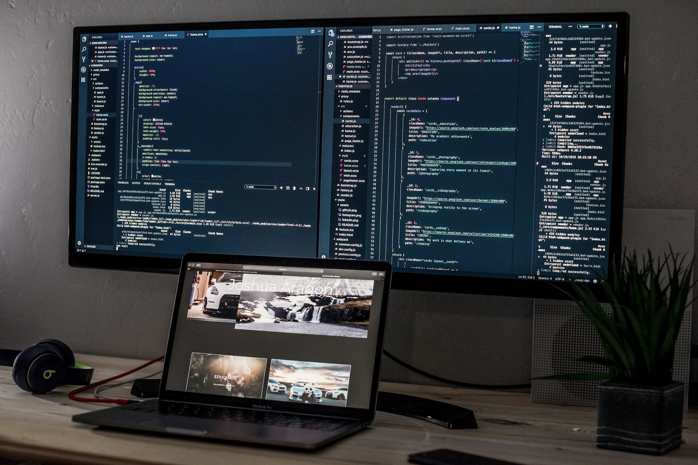

Over the last couple of weeks, I have been providing portfolio feedback to current students at my old university. After sharing tips and tricks I have picked up over the years about improving my portfolio and selling my skills. I thought it may be a good idea to do a “series” of posts sharing these details on my blog to help more people.

In this first post, I will cover what to look for when deciding on what portfolio service/solution to go for. I will cover several services that offer both free and paid solutions.

## Codeless Solutions

### But what if I’m not a web developer or I can’t code?

Thankfully today there are a lot of services that can take care of this. Companies like Wix, Weebly, Squarespace, WordPress and GoDaddy offer users the ability to create a website without looking at a single line of code. So if you can’t code or don’t want to learn web development this could be the ideal solution for you to go with.

### But how do I choose a service?

Like everything, this comes down to your needs and wants. Wix, Weebly, WordPress and GoDaddy offer free for life plans of their service with limited features. Whereas Squarespace only offers a 14-day free trial. What’s offered in their paid tiers also differs between each company. For instance, connecting a custom domain to a Wix site will cost you £3 a month, whereas Weebly charges a minimum of £4 a month for this feature. However, even on this paid plan, your website will still feature Wix and Weebly adds visible to visitors. Whereas the minimum paid plan of £4 a month from WordPress will allow you to connect a custom domain and remove all WordPress ads.

<figure>
  
  <figcaption>
    Photo by [Branko
    Stancevic](https://unsplash.com/@landb?utm_source=unsplash&amp;utm_medium=referral&amp;utm_content=creditCopyText)
    on
    [Unsplash](https://unsplash.com/?utm_source=unsplash&amp;utm_medium=referral&amp;utm_content=creditCopyText)
  </figcaption>
</figure>

If it was me personally trying to make this decision. I would first narrow down these services by checking whose pricing fits my budget. This can be especially important if you are a student or are just starting you might not want to or be able to spend a lot of money on this. Then look at what’s included in each tier. Making sure to check the small print here as well, most services that offer a free custom domain only offer this for the first year of your subscription. Once I have narrowed my results with these points, I would make use of their free trials and plans. What you're looking for here are things like how easy are the tools to use, how easy is it to add, remove or change the content. You're potentially going to be spending quite a bit of time using these tools so make sure they provide an enjoyable experience.

## Coding Solutions

If you can code your website or you can and want to spend the time learning to create websites. This can help save you money in the long run. Services like Netlify and GitHub Pages give anyone with an account the ability to host their own website. Each of these services offers SSL certificates and the ability to connect a custom domain free of charge.
Then services like Netlify offer even more goodies with their free plan. Such as 100 form submissions a month. So you can even include a contact form, that will email you when you get a submission for no charge at all. However, both do have a bandwidth limit of 100 GB a month. But for small personal sites, I don’t see anyone going over this limit.

### So who do I choose?

After using both services, I am happy to recommend both of them. If you are only planning on hosting a single static site and already have a GitHub account. I would suggest sticking with them. However, If you're a web developer and looking to host several websites, I would suggest Netlify. They do allow you to host an unlimited number of websites but as I said you are limited to 100 GB of traffic a month. As well as only having 300 build minutes a month available to your account. But if you are just hosting small demo websites you will be fine with these limits.

<figure>
  
  <figcaption>
    Photo by [Joshua
    Aragon](https://unsplash.com/@goshua13?utm_source=unsplash&amp;utm_medium=referral&amp;utm_content=creditCopyText)
    on
    [Unsplash](https://unsplash.com/?utm_source=unsplash&amp;utm_medium=referral&amp;utm_content=creditCopyText)
  </figcaption>
</figure>

## Choosing a Domain

When it comes to choosing a domain, these days it's usually personal preference on what extension you use. Some people stick with the traditional .com, some use .me, I’ve seen developers use .io. I use a .co.uk domain as you have no doubt seen. The reason I went with this was down to the .com being unavailable, and I am a UK based resident, so I felt this was a good choice. My suggestion to you would be to find a group of extensions you like and wouldn’t mind using then see if your ideal domain is available. I recommend having a group of options as you may not get your first, second or even third choice.

## Final Words

Don’t feel like you need to use one of the solutions I have mentioned. Use this post as more of a checklist or part of a checklist of what to look for when setting up your personal website/portfolio. This is a choice you need to make on your own and this choice will most likely change in the future. But just getting started on your portfolio is the most important thing to do. I have switched between three different hosting providers in the last 4 years. As well as redesigning my portfolio five-plus times in this time frame. And will no doubt make changes in the future as my needs change.
