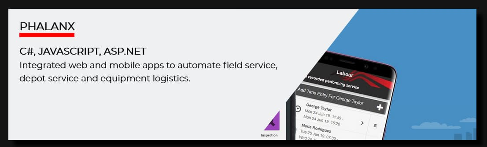
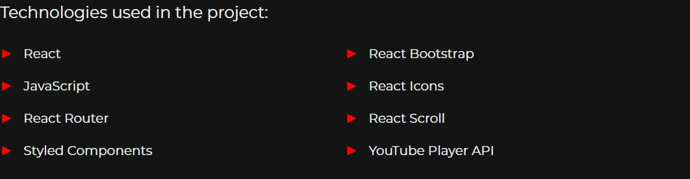
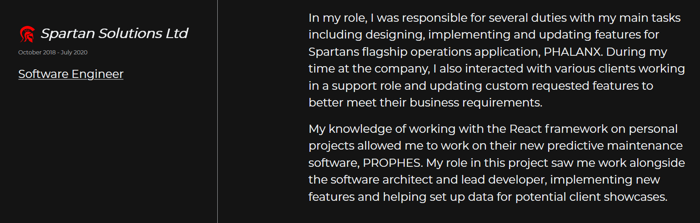
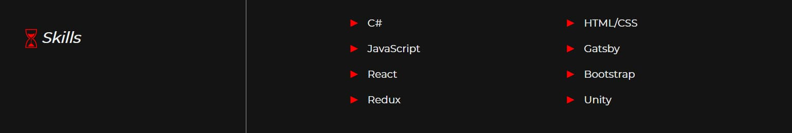
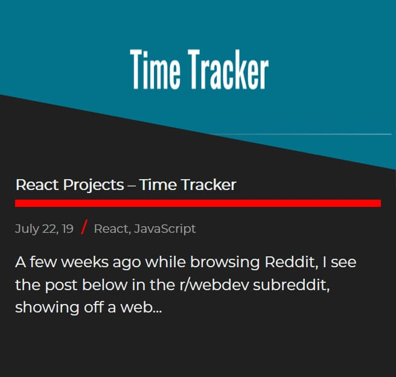

This post is a continuation from my last post, sharing tips and tricks on creating your own portfolio/personal website, to show off your work and skills. In this post, I am going to share some tips of what you should include in a portfolio. I will mainly focus on the content of the site rather than the visuals. I will also write from a coder's perspective. However, you should be able to adjust areas to fit your specific needs, whether you're a coder, artist or designer.

## Main Goal and Aim

The main goal of your website is to give you a place to sell your skills and experience to recruiters or employers within your respective industry. Today we are going to look at this by focusing on the following:

<ul>
  <li>Promoting your best work.</li>
  <li>
    Making it easy for people to find out about your skills and experience.
  </li>
  <li>Make your most important information stand out as much as possible.</li>
  <li>Give details about yourself and your work whilst being concise.</li>
</ul>

## Projects

The project section of your site is the most important part of your portfolio. You want to use this section to show off your best work and only your best work. For instance, if you've created ten pieces of software. But you are only happy with four of the projects, then only show off these four projects here. Many people say your portfolio is only as strong as your worst piece of work. So lead with your best foot and cut any projects that do not show off your full potential.

When showing off my projects. I like to provide key information about the project, such as the technologies used and a short two/three sentence description. You can see this by mousing over each project listed on my site. Then I provide more information about the project on its dedicated page. This allows recruiters and potential employers to see key project information at a glance. Whilst giving them the option of learning more about a project without cluttering up my site with tons of text.

<figure>
  
  <figcaption>
    An example of key project details that are visible when hovering over a
    project.
  </figcaption>
</figure>

On the project page, I like to describe the project itself. Highlight what technologies were used to create the project and summarise my tasks and responsibilities using a list. You'll see I use the bright red of my site in these lists to help draw the user's eyes to this key information. It's also a good idea to provide screenshots or a video of the project. But even better is if you can provide a link for them to try out the project, whether that is a demo or a download of the final piece of software.

<figure>
  
  <figcaption>
    An example of how I list the technologies I used in a project.
  </figcaption>
</figure>

For my projects, I also like to share links to my GitHub where anyone can view the source code. This also helps you stand out, as potential employers have direct evidence of your skills and abilities.

## Experience/Resume

I think it's beneficial to include a resume/experience section to your website. In this section, you want to give details about any relative industry and or educational experience you have. For any industry experience, you want to note down the company name and provide one or two paragraphs about what your role there was and what your tasks were.

<figure>
  
  <figcaption>
    An example of how I write about my profressional experences.
  </figcaption>
</figure>

Don't worry if you are creating your first portfolio and you don't have any industry work. I didn't get my first job in software until five months after I graduated from university. Focus on highlighting your education, whether that's college, university or a boot camp. What I did was to speak about my classes, what each class involved, and what technologies I used to complete my projects.

Similarly, if you are learning to code using online courses, add these here listing what you worked with and learned during the course. I would however, advise against placing the projects you made from these courses in your projects section. Instead I would create something at least a little different.

You can also use this section to show off any awards you may have won. This could be awarded from your work, education institute, networking or coding events, etc. This is where you also want to highlight your key skills with the different technologies it uses. Whether that be a software package, programming language or game engine. I find it best just to list them here and not to use an arbitrary experience level indicator such as a percentage level. As there is no standard for this measurement.

<figure>
  
  <figcaption>How I like to list my skills.</figcaption>
</figure>

I also like to include a downloadable version of my resume. Sometimes recruiters and hiring managers at companies like to have a physical copy of your resume they can share. So giving them another method of easily getting a copy makes it more convenient for them. I would suggest you don't include any information that is too personal for the internet. Such as your address or phone number.

## About

In my about section, I like to focus more on my professional background and what I have accomplished. Both in my role as a developer and during my education. I also mention what technologies I am interested in working with for professional and personal projects.

I think these details make better use and help me stand out more. Rather than me speaking about my B-grade zombie movies and shows are amazing and more people should watch them. I also use this section again to list and highlight my skills.

## Contact

If possible, I would recommend adding a contact form to your website. This gives people on mobile and desktop an easy way to contact you. However, if you cannot then you should as a minimum include your email. If you can allow users to click on the email address and copy it straight to their keyboard, this would be an even better user experience.

<figure>
  
  <figcaption>
    My social media link icons that can be found in the contact section or the
    site
  </figcaption>
</figure>

It's recommended to do this over setting it to open the mail client on their device. As it is not guaranteed a visitor will have this set up. You should also use this section to advertise your social media using large noticeable icons for visitors to notice.

## Blog

Writing a personal blog is another way to help your portfolio stand out from the crowd. You can use this to show off those additional projects you don't feel are good enough to show off in your projects section. Writing about things you have learned is also noted as a good way to help reinforce learning.

<figure>
  
  <figcaption>
    Example of a blog post speaking about a project not good enough for projects
    section.
  </figcaption>
</figure>

Creating posts about tackling a bug you ran into can be a way to help direct traffic to your site. This helps promote you and your work. And act as an example of your skills and knowledge.

## Closing Remarks

Thank you for reading. I hope you got some helpful tips and advice you can put to use. You don’t need to use everything I spoke about or even feel you need to use it exactly as I used and described it. Instead, take whatever is going to benefit you the most and mould it into a solution that suits you best.

Included below are several links to resources with more portfolio and career advice and tips. If you have any questions feel free to use my contact section to send me a message or follow my social media links and get in touch with me there.

## Additional Resources

[Establishing Your Personal Brand With Cassidy Williams - Chats with Kent](https://kentcdodds.com/chats-with-kent-podcast/seasons/01/episodes/establishing-your-personal-brand-with-cassidy-williams)

[Growing Your Skills And Career Through Teaching With Ali Spittel - Chats with Kent](https://kentcdodds.com/chats-with-kent-podcast/seasons/01/episodes/growing-your-skills-and-career-through-teaching-with-ali-spittel)

[6 Things you SHOULDN'T DO on your Portfolio - Design Course](https://www.youtube.com/watch?v=zIGoqlw_tMQ)

[Creating Killer Design Portfolios from Scratch - Design Course](https://www.youtube.com/watch?v=_DnRVy9C04U)

[7 Tips for a Better Design Portfolio - Design Course](https://www.youtube.com/watch?v=lPGM-GgIqmo)

[10 Web Developer Portfolio Tips - Traversy Media](https://www.youtube.com/watch?v=nrWGr2OvBD4)

[Hasty Treat - Tips For A Good Portfolio - Syntax](https://syntax.fm/show/133/hasty-treat-tips-for-a-good-portfolio)

[Potluck - Editor Fonts × Portfolios × Meetup Tips × Switching to Windows × Freelancing Sources - Syntax](https://syntax.fm/show/062/potluck-editor-fonts-portfolios-meetup-tips-switching-to-windows-freelancing-sources)

[HOW TO GET A JOB using Linkedin. Make your profile work for you - Danny Thompson](https://www.youtube.com/watch?v=AYIUoW8LFA0)

[ONE HUGE MISTAKE when writing your resume/LinkedIn profile! - Danny Thompson](https://www.youtube.com/watch?v=PFyfdxC0qf0&feature=youtu.be)

[How to Build a Career in Tech: Henri Helvetica Connects the Dots - FreeCodeCamp](https://www.youtube.com/watch?v=VtCUn3mY-L8)
