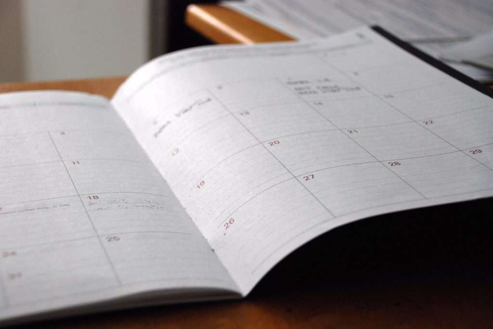
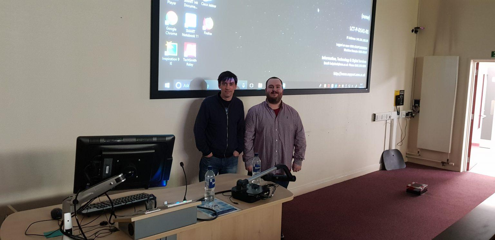

<figure>
  
  <figcaption>Photo by <a href="https://unsplash.com/@punttim?utm_source=unsplash&utm_medium=referral&utm_content=creditCopyText">Tim Gouw</a> on <a href="https://unsplash.com/s/photos/problem?utm_source=unsplash&utm_medium=referral&utm_content=creditCopyText">Unsplash</a></figcaption>
</figure>

A few months ago I was invited back to the university I used to attend, the University of the West of Scotland. To deliver my third student presentation and my second presentation on getting a job in the tech industry after graduating. I was more than happy to do this, I enjoyed doing the last two presentations and I’m always willing to help people that are in the same situation as I was.

This time however I decided to take a different approach from my previous presentation. Looking back I feel that even though I did create slides and have some structure to my previous presentation. I didn’t feel that it was as good or contentful as it could/should have been.

So, I decided that I would spend a bit more time getting prepared and find out as much information about the classes the students were from. As well as follow up with the lecturer running the class on what he felt would be most beneficial to the students. Rather than me just deciding on my own like last time.

<figure>
  
  <figcaption>Photo by <a href="https://unsplash.com/@erothermel?utm_source=unsplash&utm_medium=referral&utm_content=creditCopyText">Eric Rothermel</a> on <a href="https://unsplash.com/s/photos/problem?utm_source=unsplash&utm_medium=referral&utm_content=creditCopyText">Unsplash</a></figcaption>
</figure>

I also decided to go a little extra step and find a new customized theme for my Google Docs presentation. Just to make the slides more visually appealing and look a bit different from the default options they may have seen before.

Content and format-wise for the presentation. I went from 11 slides last year to 15 this year. Which might not seem like much, but I also went from a 30-minute presentation to an hour-long presentation filled with a lot more information.

Comparing both presentations side by side, I would say that this year’s presentation has vastly better formatting, as text information has not been crammed in nearly as much. Alongside that, I feel that this new presentation flows a lot better.

<figure>
  
  <figcaption>Speaking to the students about the benefits of social media and establishing a personal brand.</figcaption>
</figure>

I also spent a lot more time practising what I was going to say and ended up doing 4 full runs of the presentation as well as 4/5 broken runs. I think in total I must have spent about 7-8 hours just practising to myself. Which was a lot more than last year.

The final step in my preparation that I should have done last year. Was to plan my travel times out. I think last I felt that I didn’t need to do this because I attended that university for 4 years. So I thought I knew all the times and could just start my journey whenever and make it there in plenty of time. Which to probably no one’s surprise did not work out as I hoped.

By doing so, I went from rushing about last minute getting my slides ready. To being 40 minutes early and having enough time to set up and let my anxiety cool off. I was also told there were 120 students registered for the class, but I think it was closer to 100 that finally attended the presentation.

The results from the extra time spent preparing for the presentation seemed to go down well. Both of my previous lecturers <a href="https://twitter.com/GamesDevUWS">Dr Gavin Baxter</a> and <a href="https://twitter.com/DrTomHainey">Dr Thomas Hainey</a>, as well as some of the students who attended the presentation, let me know it was informative and appreciated the advice given.

<figure>
  
  <figcaption>Myself and <a href="https://twitter.com/GamesDevUWS">Dr Gavin Baxter</a> from UWS after the presentation.</figcaption>
</figure>

And at the end of the day, that is all I could ask for. It’s also my biggest worry when doing these types of presentations. As I don’t want it to be me just rambling for 1 hour. I want it to be me sharing useful advice on what I have learned and the steps I took when looking for a job so that it could help remove the stress and hurdles for other people looking to get their start in the tech industry.

As a previous student myself, I know not everyone will have listened to what I have said or put it to use. However, at the end of the day if I managed to help provide at least one person, with the tools to get their first job. It will have been 100% worth the time and effort I put in.

Finally, I would just like to close out this post out by suggesting that if you too are invited to give a presentation at one of your old schools. You should take the opportunity to do it. Not only does look good career-wise to current and future employers. But what I find most rewarding from it, is that you just get a nice feeling helping out other people and it just feels good seeing that you have helped others.
