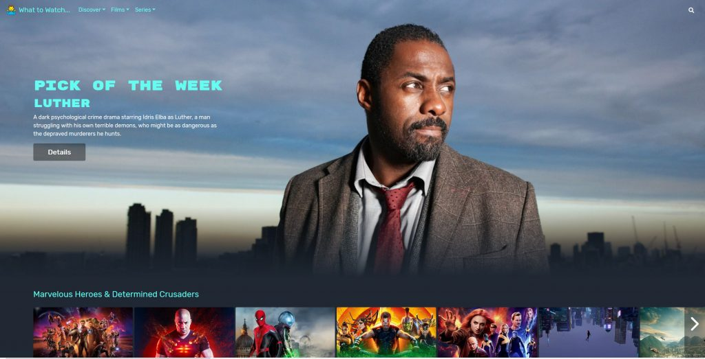
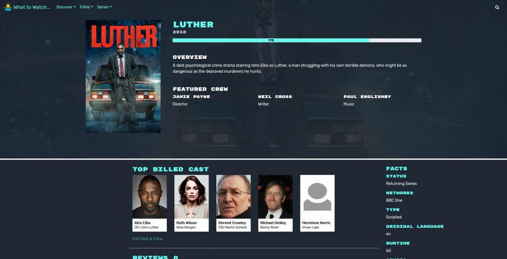
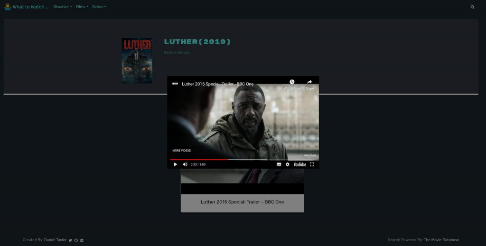
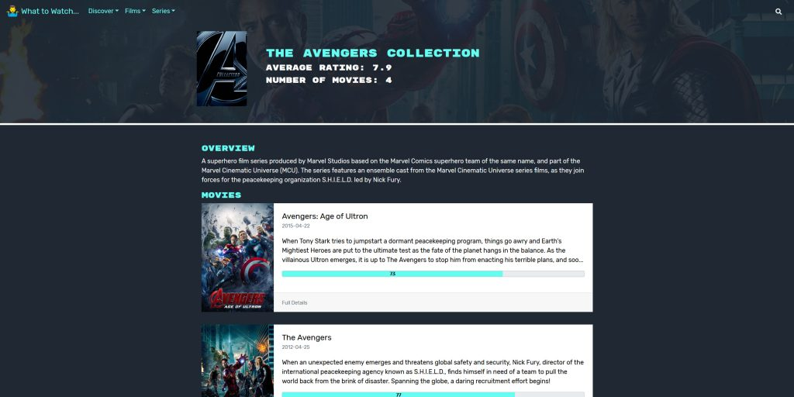
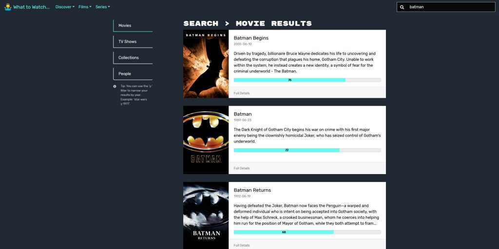

A few months ago I decided to start working on a new React project. I decided that I would make a movie and TV show searching site, using the <a href="https://developers.themoviedb.org/3/getting-started/introduction">Movie Database API</a>. I also set myself a few goals which included using React Hooks for the first time and to recreate the design and functionality of the <a href="https://www.themoviedb.org/">MovieDB</a> site without using dev tools to look at their code.

<figure class="image">
  
  <figcaption>What to Watch – Home Page</figcaption>
</figure>

The first task I set myself, was to get some of the design of the site selected and set in place. The first thing I did was choose a colour scheme, I don’t have much experience selecting colour schemes or using colour theory to select a theme. So I decide to have a browse around the web to find one I like. I found <a href="https://visme.co/blog/website-color-schemes/%20-%20bert">this post</a> on visme.co and really liked the look of the Bert colour scheme.

Next up on the list was choosing a font. I decided to hit up my usual place for fonts, Google Fonts. I ended up settling on using the Rubik font for all non-header and non-title fonts and went with Rubik Mono One for the headers and titles.

<figure class="image">
  
  <figcaption>What to Watch – About Page</figcaption>
</figure>

In terms of site icons, I decided to switch it up and go from generally using Font-Awesome to using <a href="https://react-icons.github.io/react-icons/#/">React-Icons</a>. Which is a collection of different icon libraries including the Font Awesome library. And additionally, I used <a href="https://react-bootstrap.github.io/getting-started/introduction/">React Bootstrap</a> and <a href="https://styled-components.com/">Styled Components</a>, which I now always use in my React projects for styling components.

The first part of the site I decided to develop was the home page. I originally thought that I had an original idea for its design and layout. But it ended up being a clone of the Netflix home page. I am not entirely sure how I didn’t realise the vision in my head was from Netflix but I continued on. I am very please with the development of the page and feel I done a good job of creating a layout and experience similar to that of the Netxlif site, without looking at any of their styles.

Following the development of the home page, I continued on by trying to reproduce the other pages based on the MovieDB website, as I previously mentioned. I really enjoyed trying to recreate the various pages of the site using React Bootstrap, my own components and CSS.

<figure class="image">
  
  <figcaption>What to Watch – Trailer</figcaption>
</figure>

One part or feature of the site that I had some trouble creating, was reusing the <a href="https://react-bootstrap.github.io/components/modal/">Modal component</a> from React Bootstrap with a YouTube Player that accepted an Id. One issue I was running into, was having multiple YouTube players being created when loading the modal, which was slowing down the site. After some searching online, I found this post on <a href="https://stackoverflow.com/questions/39517830/render-iframe-video-using-youtubes-js-api-with-reactjs">Stack Overflow</a> showing how one user, used the YouTube API for playing videos and passing in an ID to get said video with React. After reading this post and looking at the <a href="https://developers.google.com/youtube/v3">YouTube API docs</a>, I was able to reduce some of the code and have it work perfectly for my needs, as you can see above.

One thing I did need to brush up on after taking a break from using React. Was using some of the features of React Router for navigating the site and passing in various data to queries. Thankfully I managed to find two videos covering various features of React Router, one from <a href="https://www.youtube.com/watch?v=Law7wfdg_ls">DevEd</a> and the other from <a href="https://www.youtube.com/watch?v=ZBxMljq9GSE">LearnCode.academy</a>. These videos allowed me to update the site and its URL so that when the user would refresh a URL any required and specific data would be pulled in from the API.

<figure class="image">
  
  <figcaption>What to Watch – Avengers Collection Details</figcaption>
</figure>

In terms of React Hooks, I really enjoyed using them and found they did reduce a fair bit of code in the project. The way I went about using React Hooks at first was to Create my first couple of pages using class components. Then using these resources from <a href="https://www.robinwieruch.de/react-hooks-fetch-data">Robin Wieruch</a>, <a href="https://www.youtube.com/watch?v=w1CKLwx2DjQ&list=WL&index=11&t=5s">Matt Upham</a> and the official <a href="https://reactjs.org/docs/getting-started.html">ReactJS Docs</a>, I converted them to use Hooks and from that point onward started using Hooks in any components that made sense.

Some other resources that helped with this project include this <a href="https://jsfiddle.net/ZTz7Q/">JSFiddle</a> on styling Horizontal Rules to fade out at the sides. <a href="https://flyclipart.com/free-png-image-shrug-emoji-png-303772">FlyClipArt</a>, where I found the Logo/Site icon and <a href="https://www.digitalspy.com/tv/a866143/luther-season-five-batman-idris-elba/">DigitalSpy</a> for providing a nice high-quality image of Idris Elba in Luther.

<figure class="image">
  
  <figcaption>What to Watch – Search Page</figcaption>
</figure>

Overall I am very please with how the project ended up and I loved working on it and seeing it come together. I worked on it on and off beginning at the end of July and finishing up the project at the start of September. You can find the source code for the project on <a href="https://github.com/dantay0803/React_Projects/tree/master/movie-listing-website">GitHub</a> and you can also see a live demo by clicking this <a href="https://danielt.co.uk/whattowatch/">link</a>.

Thank you very much for reading this post and if you have any additional questions about the project feel free to send me a message.
