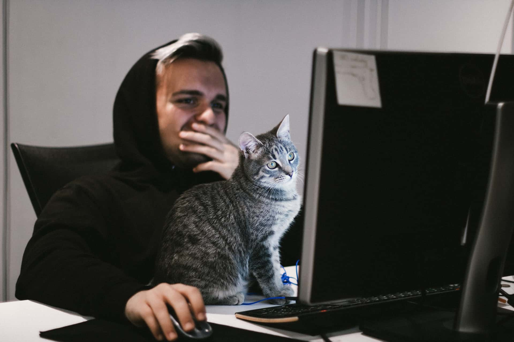
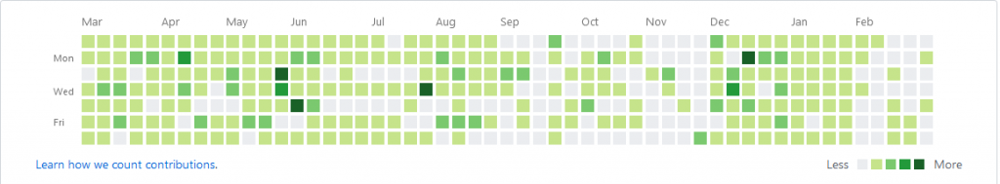
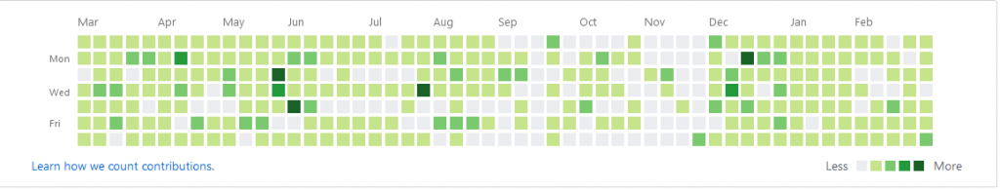

I’ve been meaning to write this post for a while now, but never really knew how or where to begin it. Though after noticing a similar pattern come up again, I decided to leap at the opportunity.

The issue I want to address in this post is the feeling that I had to make at least one commit a day to GitHub, to prove my worth as a developer. Even if I had spent the day coding, reading developer blogs and listening to podcasts. I felt like none of that mattered if there was no activity on my profile to prove I had done something. When in reality I know there is no one constantly checking my GitHub activity to determine my worth as a developer. However, knowing this still didn’t stop the voice in my head from pushing me to do it.

<figure>
  
  <figcaption>
    Photo by{' '}
    <a href='https://unsplash.com/@neringa?utm_source=unsplash&utm_medium=referral&utm_content=creditCopyText'>
      Ga
    </a>{' '}
    on{' '}
    <a href='https://unsplash.com/s/photos/problem?utm_source=unsplash&utm_medium=referral&utm_content=creditCopyText'>
      Unsplash
    </a>
  </figcaption>
</figure>

The thing is, not all commits to GitHub are for a new feature or a drastic change to a project. There are also times where you may need to push changes to fix something like the size of an image or a spelling mistake. In the past, I have even created a couple of empty repositories far in advance of when I would actually use them, just to keep my activity streak up.

Plus even when you are actively working on a project and making commits. There are times where someone may view your profile and see next to no activity. Whereas if they viewed it a day later, they would see lots of activity.

<figure>
  
  <figcaption>GitHub Heat Map Before Merging Portfolio Branch</figcaption>
</figure>

For example, If you look at the image above you can see my profile around February doesn’t have much activity. Then if you look at the image below, that’s what my activity looked like after merging the branch I was working on at that time into master.

<figure>
  
  <figcaption>GitHub Heat Map After Merging Portfolio Branch</figcaption>
</figure>

If you’ve stumbled across this post because you’ve had the same or a similar feeling. I hope it shows that just because someone may appear busier than you, that is not always the case. Similarly, if what you have been working on that day was not in a state to be shared publicly or committed to the project’s repository, it doesn’t mean you haven’t done anything that day or you aren’t a hardworking developer.

Keep pushing yourself, keep learning and keep having fun and you’ll make some great products for your users and clients.
